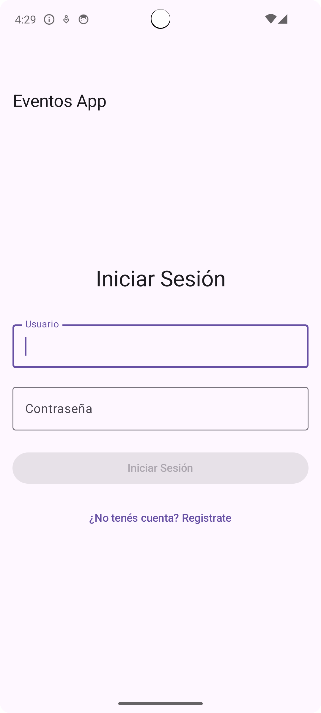
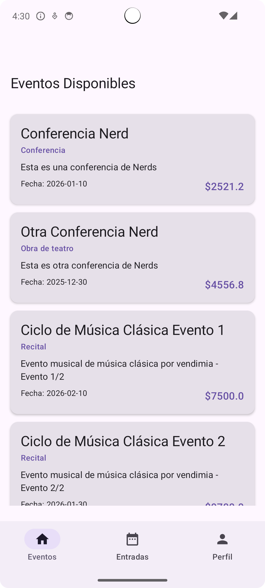
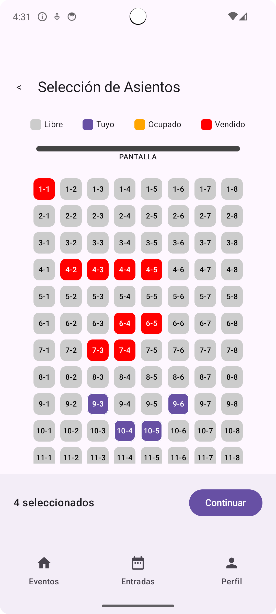
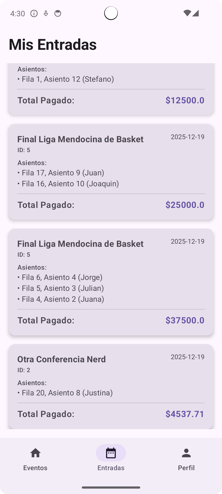

# 🎓 Trabajo Final 2025 - Sistema de Asistencia a Eventos

Este repositorio contiene el desarrollo del Trabajo Final para la materia **Programación II**. El proyecto consiste en un sistema distribuido para el registro y gestión de asistencia a eventos únicos (charlas, cursos, obras de teatro) con venta de entradas y selección de asientos en tiempo real.

## 🎯 Objetivo General

El sistema permite a los usuarios:
- Visualizar un listado de eventos disponibles.
- Seleccionar asientos específicos en tiempo real.
- Confirmar la compra de entradas y visualizar los tickets adquiridos.

---

## 🏛️ Arquitectura del Sistema

El sistema utiliza una arquitectura de microservicios y se integra con servicios externos provistos por la cátedra.

### 🧱 Componentes de la Cátedra (Provistos)
| Servicio | Descripción                                                               |
| :--- |:--------------------------------------------------------------------------|
| **API REST (Java)** | Gestiona la lógica de negocio (eventos, ventas oficiales, bloqueos).      |
| **Kafka** | Notifica cambios en tiempo real sobre los eventos y estados de asientos.  |
| **Redis** | Almacena el estado global de los asientos (libres, ocupados, bloqueados). |

### 🛠️ Componentes Desarrollados
El sistema se divide en tres partes:

1.  **Backend:**
    - Desarrollado en **Java 17** con **Spring Boot**.
    - Gestiona usuarios, sesiones y persistencia local de ventas.
    - Se comunica con el **Proxy** para consultar asientos y con la **Cátedra** para sincronizar eventos.
    - Utiliza **PostgreSQL** para persistencia y **Redis local** para sesiones.

2.  **Servicio Proxy:**
    - Desarrollado con **JHipster / Spring Boot**.
    - Es el único componente del alumno con acceso directo al **Kafka** y **Redis** de la cátedra.
    - Expone una API simplificada para que el Backend consulte el estado de los asientos.
    - Escucha eventos de Kafka para notificar cambios.

3.  **Cliente Móvil:**
    - Desarrollado en **Kotlin Multiplatform (KMP)** con **Compose Multiplatform**.
    - Interfaz gráfica moderna y reactiva.
    - Permite: Login/Registro, exploración de eventos, mapa de asientos interactivo y gestión de "Mis Entradas".

### 📐 Diagrama de Arquitectura

*Diagrama de flujo e interacción entre los componentes del sistema.*

---

## 🚀 Tecnologías Principales

| Componente | Tecnologías |
| :--- | :--- |
| **Backend** | Java 17, Spring Boot, Spring Data JPA, Spring Security (JWT) |
| **Proxy** | JHipster, Spring Boot, Spring Kafka, Spring Data Redis |
| **Cliente Móvil** | Kotlin Multiplatform (KMP), Compose, Ktor Client, Koin |
| **Base de Datos** | PostgreSQL (Local) |
| **Cache / Sesión** | Redis (Local) |
| **Infraestructura** | Docker & Docker Compose |

---

## 🛠️ Cómo ejecutar el proyecto

### 📋 Prerrequisitos
- **Docker & Docker Compose**
- **Android Studio** (para el cliente móvil)

### ▶️ 1. Servidores (Backend, Proxy e Infraestructura)
Desde la raíz del proyecto, inicia todos los servicios con Docker:
```bash
docker-compose up -d --build
```
Este comando levantará automáticamente:
- **Infraestructura:** PostgreSQL, Redis, Kafka.
- **Backend:** Accessible en `http://localhost:8081`.
- **Proxy:** Accessible en `http://localhost:8085`.

### ▶️ 2. Cliente Móvil
Abre la carpeta `mobile/` con **Android Studio** y ejecuta la aplicación `composeApp` en un emulador o dispositivo físico. El cliente se conectará automáticamente al backend levantado en Docker.

---

## 📸 Capturas del Sistema

| Inicia Sesión | Listado de Eventos |
| :---: | :---: |
|  |  |

| Selección de Asientos | Mis Entradas |
| :---: | :---: |
|  |  |

---
**Alumno:** Stefano Palazzo  
**Materia:** Programación II  
**Año:** 2025
